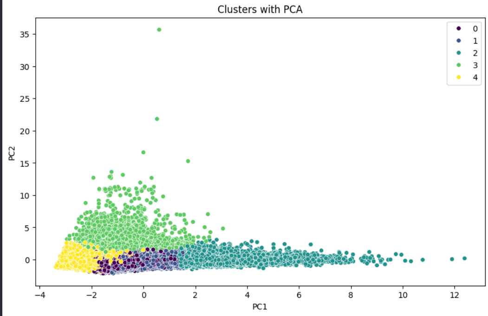

# 🔍 Clustering and Visualizing Unlabeled Data

This repository contains a mini-project focused on clustering and visualizing high-dimensional, unlabeled data using unsupervised machine learning techniques. It's part of the **CAM101 Week 6** coursework and explores key steps in a clustering workflow including preprocessing, dimensionality reduction, and model evaluation.

---

## 📁 Project Structure

```
cam101-week6-clustering-project/
├── README.md                          # Project overview and usage guide
├── notebook/
│   └── clustering_project.ipynb       # Main Jupyter Notebook
├── docs/                              # Markdown documentation for each step
│   ├── 01_intro.md
│   ├── 02_data_loading.md
│   ├── 03_data_preprocessing.md
│   ├── 04_clustering_methods.md
│   ├── 05_dimensionality_reduction.md
│   ├── 06_evaluation.md
│   └── 07_conclusion.md
├── src/                               # Modular Python scripts
│   ├── preprocessing.py
│   ├── clustering.py
│   ├── visualization.py
│   └── dimensionality_reduction.py
├── assets/
│   └── [visuals generated from notebook]
```

---

## 💡 Project Highlights

- 🧹 **Preprocessing Pipeline**: Feature scaling, missing value handling, and transformation functions.
- 📊 **Unsupervised Clustering Algorithms**:
  - **K-Means Clustering**
  - **DBSCAN**
  - **Hierarchical (Agglomerative) Clustering**
- 🔍 **Dimensionality Reduction**:
  - **Principal Component Analysis (PCA)**
  - **t-Distributed Stochastic Neighbor Embedding (t-SNE)**
- 🧪 **Evaluation Metrics**:
  - Silhouette Score
  - Davies-Bouldin Index
  - Elbow Method
- 📈 **Visual Analysis**:
  - Cluster plots in 2D space
  - Dendrograms
  - Metric comparison charts

---

## 🔧 How to Use

1. **Clone the Repository**
   ```bash
   git clone https://github.com/yourusername/cam101-week6-clustering-project.git
   cd cam101-week6-clustering-project
   ```

2. **Install Dependencies**
   ```bash
   python -m venv env
   source env/bin/activate  # or `env\Scripts\activate` on Windows
   pip install -r requirements.txt
   ```

3. **Run the Notebook**
   Open `clustering_project.ipynb` from the `notebook/` folder:
   ```bash
   jupyter notebook notebook/clustering_project.ipynb
   ```

4. **Explore the Markdown Docs (Optional)**
   The `docs/` folder provides detailed breakdowns for each step in the pipeline.

---

## 📎 Dataset

- The dataset contains multivariate, unlabeled features (details are explained in `docs/01_intro.md`).
- The data underwent preprocessing before applying clustering algorithms.
- Features are normalized and analyzed in both original and reduced dimensions.

---

## 📊 Sample Visualization



This 2D PCA projection shows how samples were grouped using DBSCAN, providing insight into separability and density.

---

## 🤝 Contributions

This project was completed as part of the CAM101 curriculum.

- **Author**: ***Onyeka Muoka***

Feel free to fork, modify, and extend this project for your own machine learning pipelines.

---

## 📄 License

This repository is licensed under the [MIT License](LICENSE).
